# YLLOW Beta

## UI Demo

Press [here](https://www.youtube.com/watch?v=3a-CfYcUv8g&list=PLuGq_O7Y2F2vyal8hGXL9yvRF8MJySG6m&index=5&ab_channel=YusufMorsi) to see a demo of the app screens.

As this is the Beta version, the app screens currently aren't connected, as most of the focus has been on the UI and NFC implementation. Below are captures of the various screens within the app and links to demos of the NFC implementation.

### Log In Screen
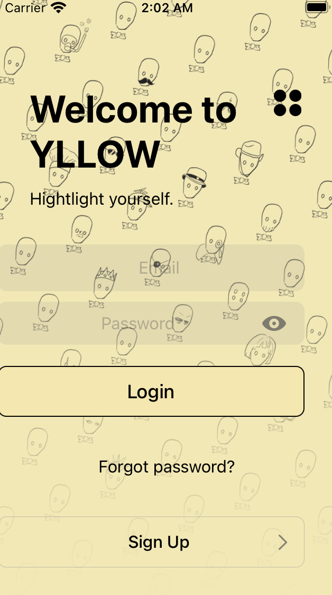

Signature YLLOW background used for this screen.

### Sign Up Screen
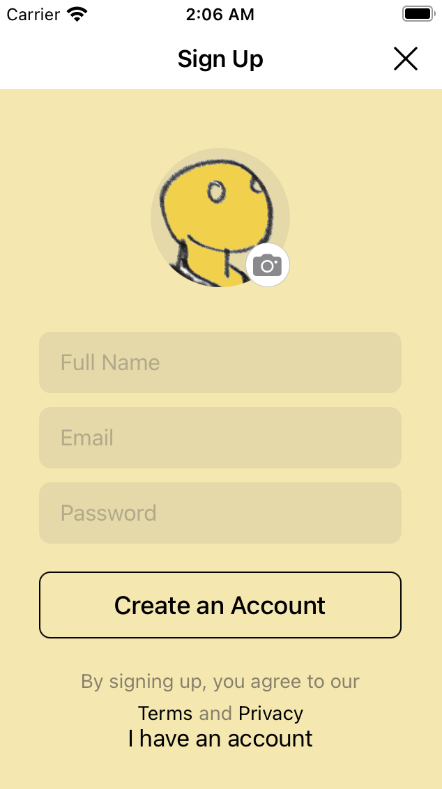

This screen is for basic user sign-up. The user can go along with the default YLLOW profile picture, or choose to upload their own.

### Location-Choosing Screen
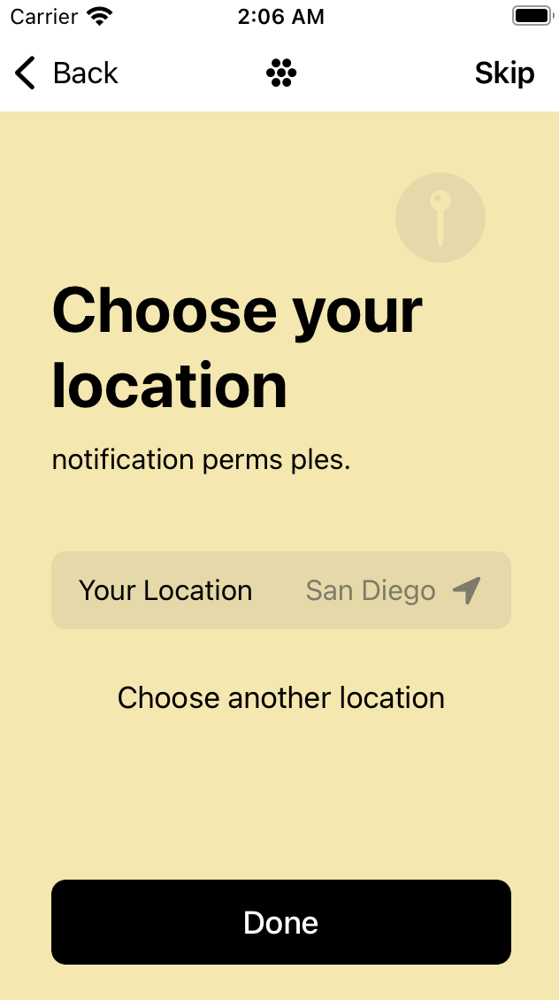

Here the user chooses their location.

### Notification Settings Screen
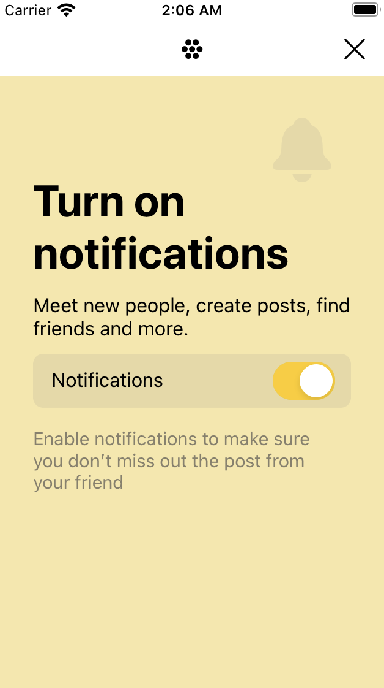

This is where the user decides to enable/disable notifications.

### User Feed Screen
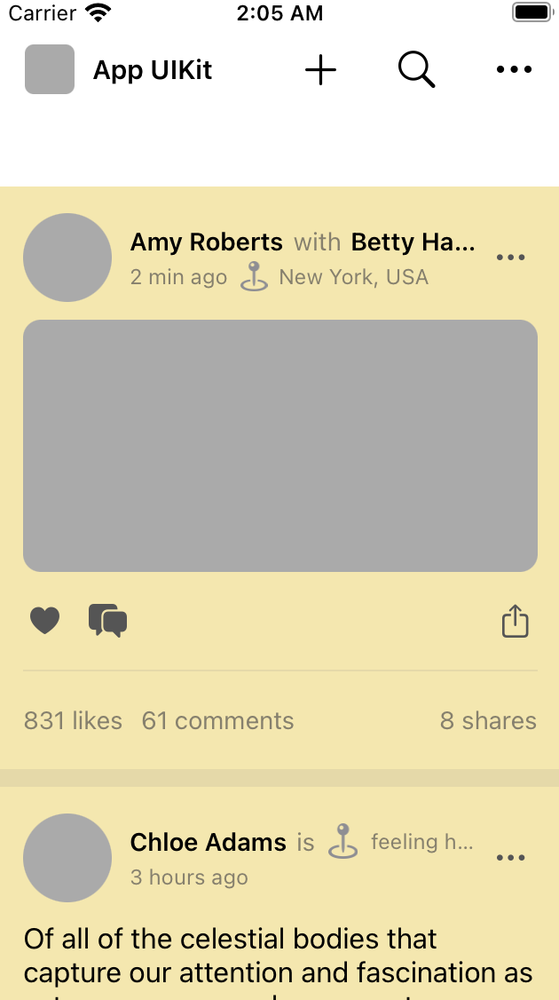

This is where user feed appears.

### Notifications Screen
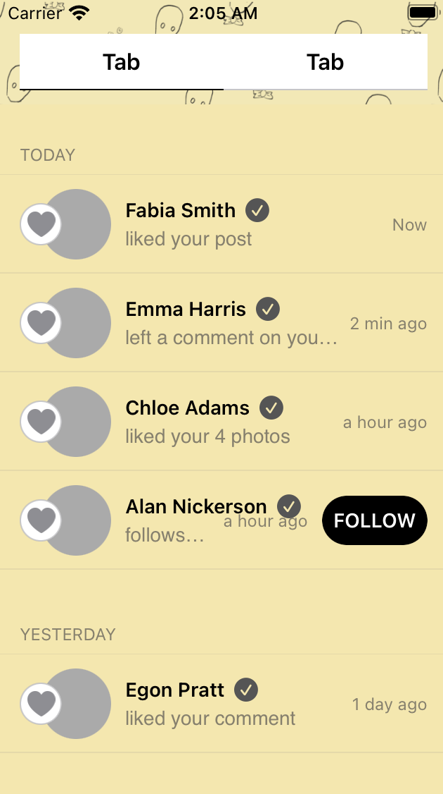

This is where the user recieves notifications.

### Invite Friends Screen
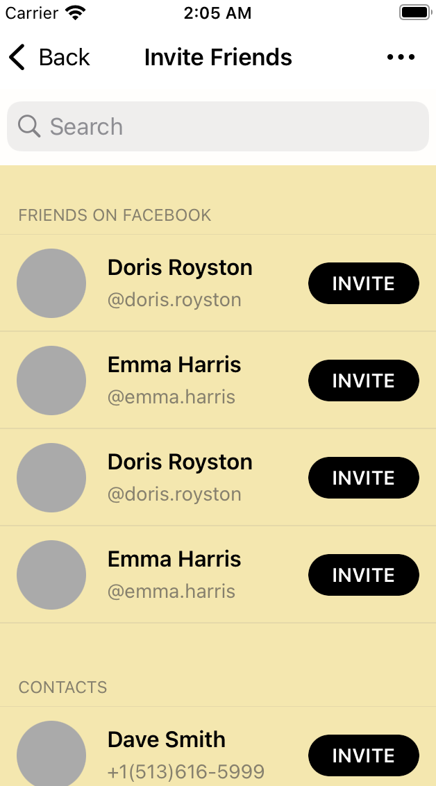

Users can choose to invite their friends to the app using this feature.

### Camera Roll Screen
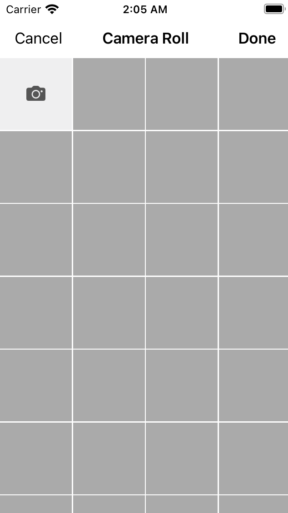

When the user decides to access this camera roll in order to upload a photo, this is what they are greeted by.

### Posting Screen
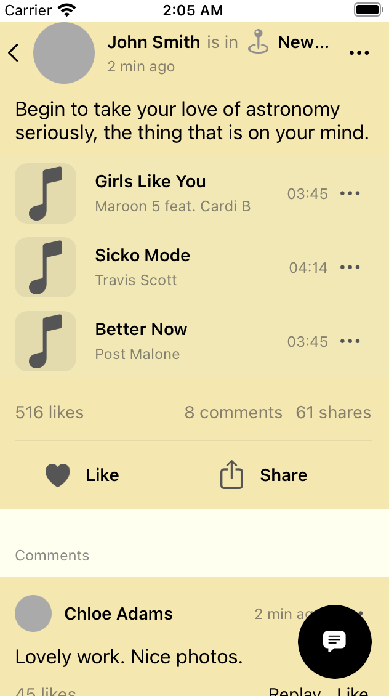

This is the screen the user is met with then they are about to post.

### Commenting Screen
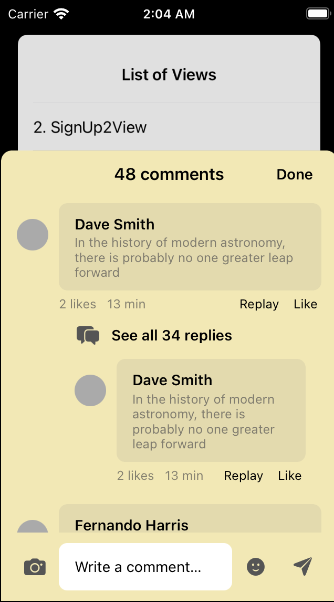

This is what the user sees when they are about to comment,.

### View Comments Screen
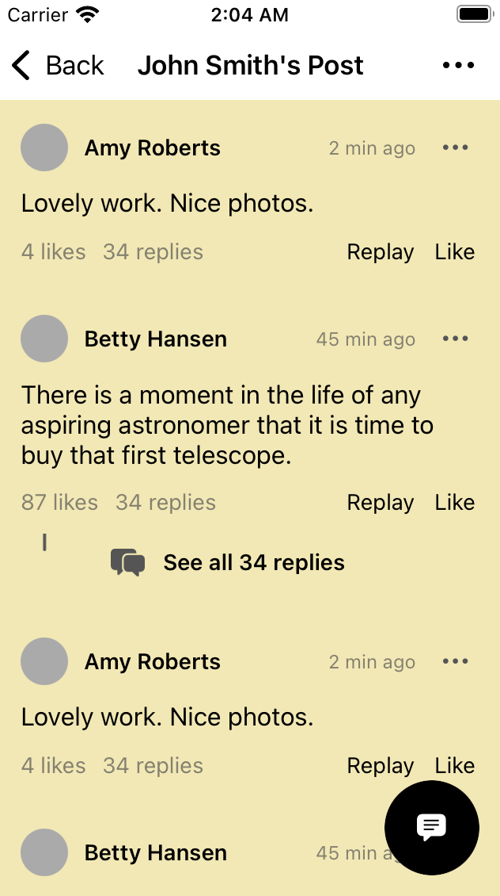

This is what the user sees when they want to view comments.

### Add Post Screen
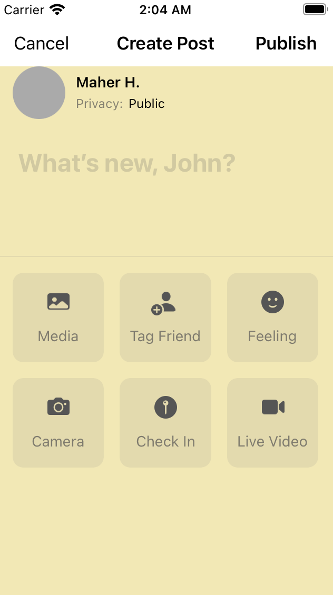

This is the screen the user sees when they are about to create a post.

### Friends List Screen
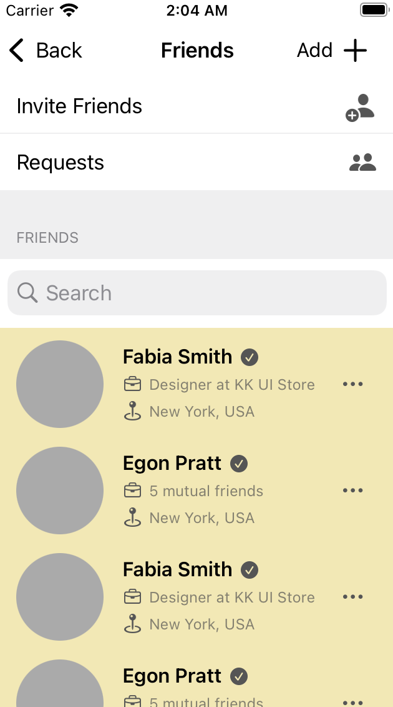

This is where the user can find a list of their friends.

### Post Options Pop-Up
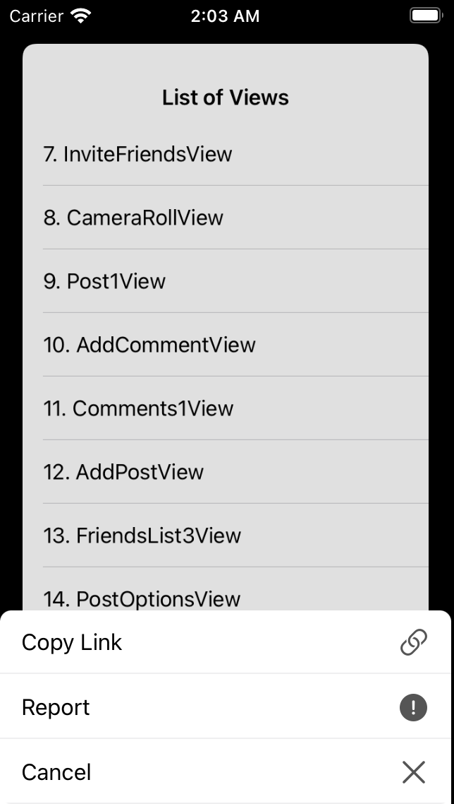

This is what comes up when the user wants to view their options on a post. They can copy a link to the post, report it, or cancel to exit.

### Profile Screen
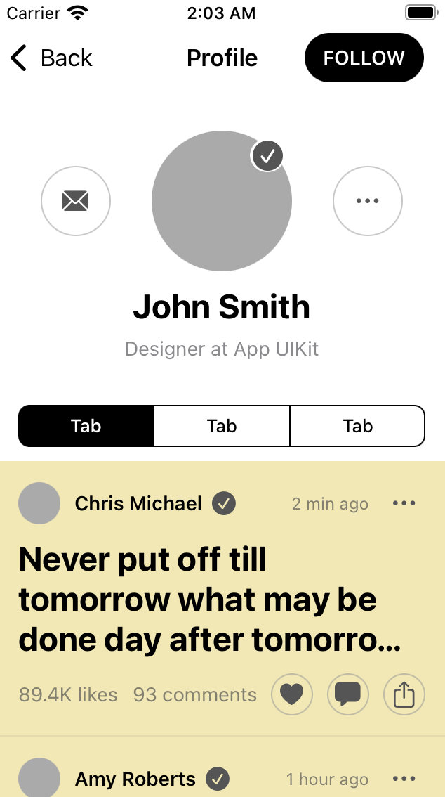

This is what the basic user profile looks like.

### User Settings Screen
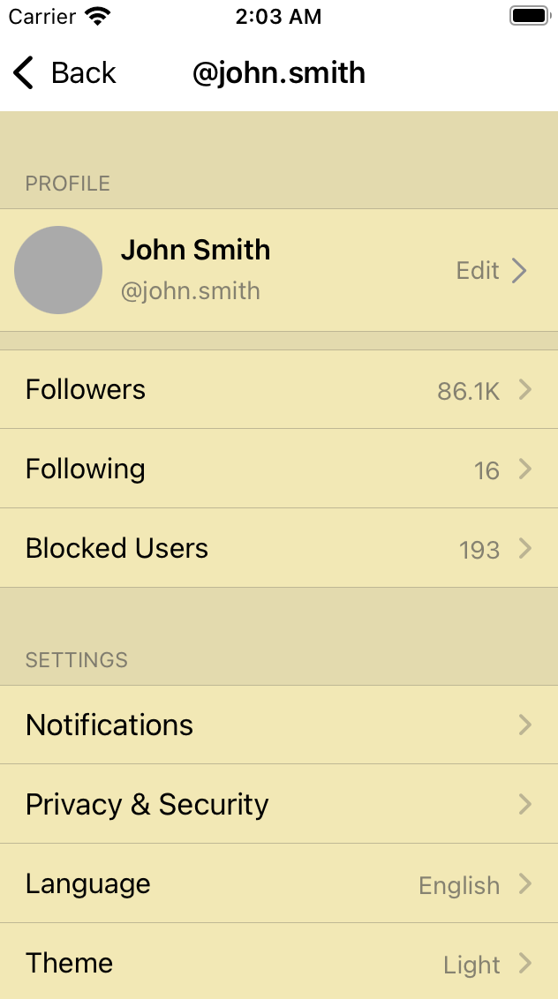

These are the user settings.

### Edit Profile Screen
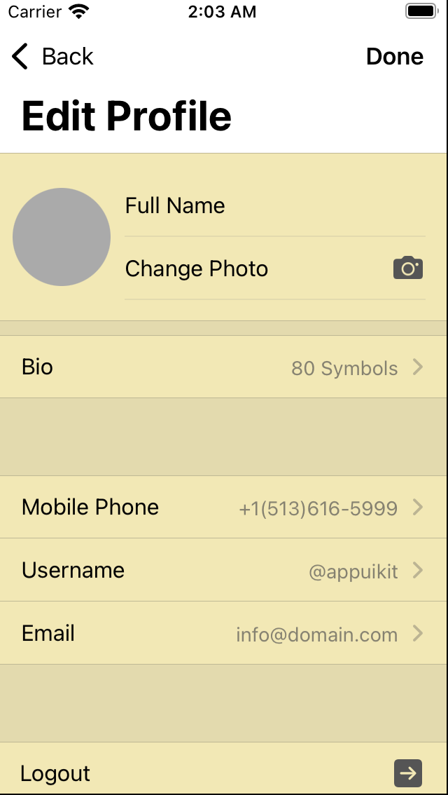

This is what the user sees when they want to edit their profile.

## NFC Reader
[Here](https://www.youtube.com/watch?v=VLjODNeSnoY&list=PLuGq_O7Y2F2vyal8hGXL9yvRF8MJySG6m&index=3&ab_channel=YusufMorsi) is a demonstration of NFC tag reading capabilities achieved through Swift. The simulator returned an error stating that the device does not support NFC reading because Apple does not support the emulation of NFC reading on their simulators at the moment.

## NFC Writer Example App (from Apple's site)
[This](https://www.youtube.com/watch?v=aGcrWoGwIAU&list=PLuGq_O7Y2F2vyal8hGXL9yvRF8MJySG6m&index=4&ab_channel=YusufMorsi) is a demo of a writing app from [Apple's website](https://developer.apple.com/documentation/corenfc/creating_nfc_tags_from_your_iphone) (used as an example for NFC-writing capabilities). The simulator returned an error stating that the device does not support NFC writing because Apple does not support the emulation of NFC writing on their simulators at the moment.